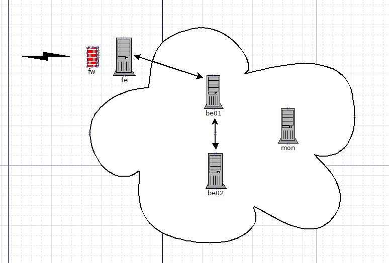

# Выпускной проект
## Тема "Автоматизация создания/восстановления тестового стенда с веб-сервисом"

## Описание стенда




Стенд состоит из 5 хостов:  
- fe - frontend на базе nginx, служба ufw.  
- be01 - backend на базе nginx, сервис wordpress, сервер БД mysql, master.  
- be02 - сервер БД mysql, slave.  
- mon - сервер мониторинга на базе zabbix, сервер сбора логов на базе graylog, отправка уведомлений в telegram.  
- image - образ с предустановленными пакетами, для восстановления отказавшего хоста.  

## Как работает стенд
При обращении по адресу https://blog.local/ открывается страница локального nginx на хосте fe (Screenshot FE).  
При обращении по адресу https://blog.local/blog/ происходит перенаправление на хост be01 c wordpress через rewrite + reverse proxy (Screenshot BE).  
На скриншоте Screenshot graylog показана работа сервера сбора логов.  
На скриншоте Screenshot mon_alert показана работа сервера мониторинга + алерт в telegram.  

Стенд собирается командой из каталога с проектом:
```
vagrant up
```
Восстановление хоста производится командой (например, при отказе хоста fe):
```
ansible-playbook -vv --tags fe_config main.yml
```
Перед запуском этой команды нужно исправить, в соответствующей секции корневого файла main.yml, строку hosts.  
В данном примере, исправляем fe на image.
```
 name: fe config
  hosts: image
```

Не успел реализовать восстановление пользовательских данных из бэкапа (данные wordpress, логи в graylog, в zabbix).  
Поэтому при восстановлении стенда они теряются.